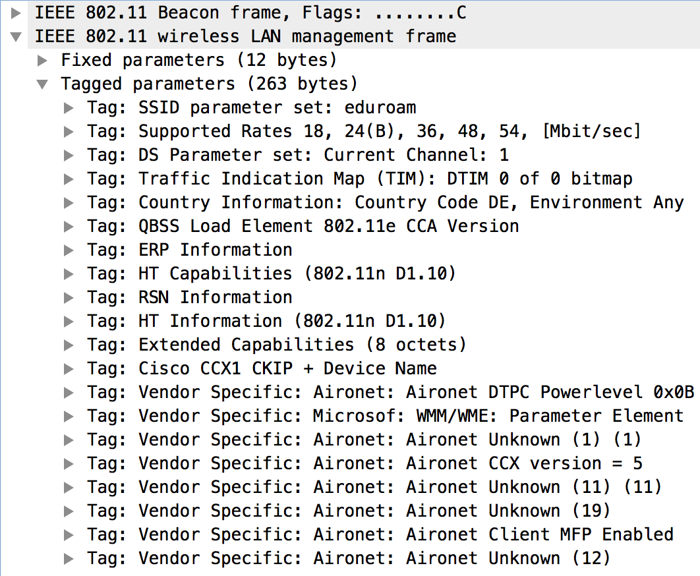
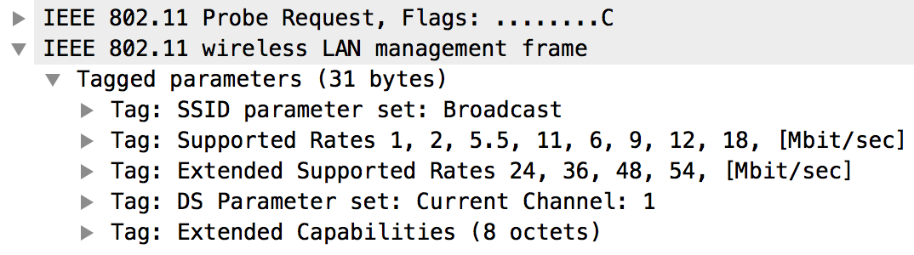

## Question 2:

### a)
* Selected channels: 1, 6, 11 (should be most used ones)
* Wireless setup:
  
  * Channel setup:  
    `iw wlan1 set channel <cnumber>`    
    `iw wlan1 info` to check wlan1 monitoring interface status

* Logging command: We decided to stop logging after 5min (ST = Stepping Stone, N6 = Node 6)
	* **Channel 1**
		
		ST: `nc -l -p 8080 > channel1.cap`
		
		N6: `iw wlan1 set channel 1`
		
		N6: `iw wlan1 info | grep channel`
		
		Output: channel 1 (2412 MHz), width: 20 MHz (no HT), center1: 2412 MHz
		
		N6: `tcpdump -i wlan1 -G 300 -w- | nc 172.17.3.1 8080`
		
		
	* **Channel 6**
		
		ST: `nc -l -p 8080 > channel6.cap`
		
		N6: `iw wlan1 set channel 6`
		
		N6: `iw wlan1 info | grep channel`
		
		Output: channel 6 (2437 MHz), width: 20 MHz (no HT), center1: 2437 MHz
		
		N6: `tcpdump -i wlan1 -G 300 -w- | nc 172.17.3.1 8080`
		

	* **Channel 11**
		
		ST: `nc -l -p 8080 > channel11.cap`
		
		N6: `iw wlan1 set channel 11`
		
		N6: `iw wlan1 info | grep channel`
		
		Output: channel 11 (2462 MHz), width: 20 MHz (no HT), center1: 2462 MHz
		
		N6: `tcpdump -i wlan1 -G 300 -w- | nc 172.17.3.1 8080`
		

**tcpdump flags explained:**
 
 * `-i wlan1` sets it to listen on interface 1 (Monitor)
      
 * `-G 300` sets it to listen for 300s or 5min
   
 *all traces are saved at ~/hw04/q2a/ on ST*
 

**Networks**

---

* Beacons on CH1:

	`tcpdump -r channel1.cap | grep Beacon | awk '{print $14}' | sed "s/[()]//g" | sort -u`
	
	Output: 
	
	```
	Group01
	LEDE
	TUB-Guest
	TUB-intern
	WirelessLab-Group04
	eduroam
	group06_ap
	```

* Beacons on CH6:

	`tcpdump -r channel6.cap | grep Beacon | awk '{print $14}' | sed "s/[()]//g" | sort -u`
	
	Output: 
	
	```
	Group01
	LEDE
	TUB-Guest
	TUB-intern
	WirelessLab-Group04
	eduroam
	group06_ap
	```

* Beacons on CH11:

	`tcpdump -r channel11.cap | grep Beacon | awk '{print $14}' | sed "s/[()]//g" | sort -u`
	
	Output: 
	
	```
	FGINET
	Group01
	Group03
	LEDE
	MMS-TECHNIK
	TUB-Guest
	TUB-intern
	WirelessLab-Group04
	eduroam
	foobar
	group002
	group06_ap
	```

* Alternatively getting networks:

	N15: `iw wlan0 scan` 
	
	Output not included because to big
 

### b)

#### Beacon Frame (Management Frame, Subtype 8)

Beacon frames are emitted by Access Points (or STA in IBSS) to advertise 
the APs service with its characteristics. This mechanism is not only
useful for already connected STAs but also for associated STA (Periodic
Frames that hold information like RSS, etc). Discovering networks listening
to beacons is called passive scanning



*Example Beacon Frame from the trace of CH1*

#### Probe Request (Management Frame, Subtype 4)

A Probe request is sent by a STA to ask for networks. This happens on 
every channel. An AP that is available for associating will reply 
with a probe response.
Discovering networks by emitting probe request and awaiting response
is called active scanning



*Example Probe Request Frame from the trace of CH1*
	
#### Differences of the two above frames

* SSID parameter set

	Usually this parameter is set to "0" (Broadcast) in Probe Request to address
	every APs whereas in Beacons the sending AP's SSID is supplied.
	
* The Beacon has additional fields like HT Capabilities, Country Information or
Vendor Specific tags. Those Parameters would be sent as Probe Response of the Probe Request.

### c)

The extended support rate tag is, as the name implies an extensions to the support
rates tag. Per definition one flag has 8 octes of data it can hold. One octet for
every supported rate. But since IEEE 802.11g there are more than 8 supported rates.
That is why simply another tag was added to hold all possible values.
When all rates fit into the Supported Rates field it must not actively add
the extended support rates field.