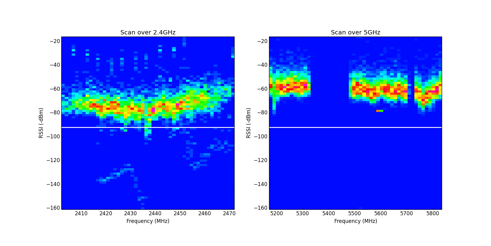

# Question 2: Spectral Scan

*The ath9k supports spectral scans. This card is installed on Node6,
thus all following commands are issued on that device if not stated
otherwise.*

## Configuration

1. Show current configuration for the scan options:

	`tail -n +1 /sys/kernel/debug/ieee80211/phy1/ath9k/spectral_*`

	Output:
	
	```
	==> /sys/kernel/debug/ieee80211/phy1/ath9k/spectral_count <==
	8
	
	==> /sys/kernel/debug/ieee80211/phy1/ath9k/spectral_fft_period <==
	15
	
	==> /sys/kernel/debug/ieee80211/phy1/ath9k/spectral_period <==
	255
	
	==> /sys/kernel/debug/ieee80211/phy1/ath9k/spectral_scan0 <==
	
	==> /sys/kernel/debug/ieee80211/phy1/ath9k/spectral_scan_ctl <==
	disable
	==> /sys/kernel/debug/ieee80211/phy1/ath9k/spectral_short_repeat <==
	1
	```
	
	Review of some parameters:
	* `spectral_count`: Nr of requested scans
	* `spectral_fft_period`: Period the PHY-Layer passed frames to 
		the overlying MAC Layer. (fft_period+1) * 4uS
		
		In this case every 64 micro seconds
	* `spectral_short_repeat` defines the spectral scan mode.
	    * 1 = 4usec scan mode
	    * 0 = 204 usec scan mode
		
2. Configure wlan1 to make it able to scan
	
	* Edit /etc/config/wireless
	
		```
		config wifi-iface 'default_radio1'
	        option device 'radio1'
	        option network 'lan'
	        option mode 'sta'
	   ```
   
   * Check that it scan:
   
   		`iw dev wlan 1 scan | head -n 9` (just show first 9 lines to show if 		it worked)
   		
   		Output:
   		
   		```
   		BSS a8:54:b2:71:d3:8b(on wlan1)
				TSF: 956888621281 usec (11d, 01:48:08)
				freq: 2462
				beacon interval: 100 TUs
				capability: ESS (0x0421)
				signal: -21.00 dBm
				last seen: 2370 ms ago
				Information elements from Probe Response frame:
				SSID: LEDE
		```
		
		**Yes, it worked!**

## Run 

1. Create shell script to run spectral scan

	`cat /root/hw05/spectral_scan`
	
	```
	#! /bin/ash


	# switch on chanscan on phy1
	echo chanscan > /sys/kernel/debug/ieee80211/phy1/ath9k/spectral_scan_ctl
	
	# perfom scan on wlan1 and drop output
	iw dev wlan1 scan > /dev/null 2>&1
	
	# save the output in /root/hw05/spectral_scan_wlan1.data
	cat /sys/kernel/debug/ieee80211/phy1/ath9k/spectral_scan0 \
	  > /root/hw05/spectral_scan_wlan1.data
	
	# disable spectral scan
	echo disable > /sys/kernel/debug/ieee80211/phy1/ath9k/spectral_scan_ctl
	```

2. Run `spectral_analysis.py` script to produce the heatmap

	

	The figure shows two heatmaps. One for each spectrum 
	(2.4 	and 5GHz) from a single scan. 
	The y-axis are syncrhonized to make a better comparison. 
	The white horizontal line represents the noise floor of the
	experiment which is -94 dBm. The hue of the color represents 
	how many fft samples were registered in discrete range of 
	x and y, where blue are fewer hits and red more frequent hits.
	
	In the 2.4GHz spectrum most frames were detected within -60 dBm 	and ne the noise floor at -94 dBm across the whole spectrum. 	Below this there are only a couple of detections which might be 
	some interfering noise 	because it spreads across multiple 
	channels. In between -20 and -40 dBm there are some 	distinctive strong signals equally distributed. They occur not 
	on the exactly on the channels center frequency which can be a 	hint of **OFDM** (Orthogonal Frequency Division 
	Multiplexing) is being used here. 
	
	The 5GHz spectrum has most of its signals with the range of -40	 - 80 dBm. Which is slightly stronger then the 2.4GHz spectrum. 
	There is also less noise on that heatmap which is natural for 	these frequencies, since 5GHz waves have a shorter range and 	less devices send on that channels. Also there are two visible 	gaps of signals from 5350 to 5500 MHz and around 5700 Mhz. These
	frequencies could be used for new devices on the medium since 	they are is no staturation.