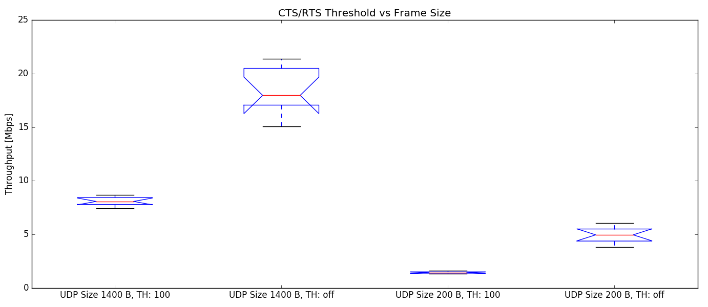

# Question 1
## a) Data throughput with and without RTS/CTS

The following figure gives an overview of the data flow from 
a STA to an AP without using RTS/CLS mechanism. A few general assumptions were made:

* no loss or collsion during transmission
* no interference 
* no hidden or exposed terminals
* no fragmentation

### Without RTS/CTS
Flow diagram:


Defintions:

* DIFS time: $t_{DIFS} = 34\ \mu s$
* Slot Time: $t_{ST} = 9\ \mu s$
* Maximum backoff slots: $b_{max} = 15$
* Random backoff: $RB = \{ n : \text{n is an integer; and } 1 \leq n \leq b_{max} \}$
* Expected backoff: $b_{expt} = \frac{b_{max} + 1}{2} = 8$
* Contention window: $t_{CW} = b_{expt} \cdot t_{ST} = 72\ \mu s$
* Propagation delay: $t_{pd} = 1\ \mu s$
* SIFS time: $t_{SIFS} = 16\ \mu s$
* PHY layer overhead = $t_{phy} = 20\ \mu s$
* OFDM symbol duration = $t_{ODFM} = 4\ \mu s$
* MAC layer data payload = $d_{mpay} = 1452\ B$
* MAC header size = $d_{mhead} = 28\ B$
* MAC ack size = $d_{mack} = 14\ B$
* PHY Layer transmission rate: $r = 54\ \text{Mbps} = 7.077888\ \frac{B}{\mu s} $
* Transmission duration data: $t_{data} = t_{phy} + t_{ODFM} + \frac{d_{mhead} + d_{mpay}}{r} \approx 243\ \mu s$
* Transmission duration ack: $t_{ack} = t_{phy} + t_{ODFM} + \frac{d_{mhead} + d_{mack}}{r} \approx 30\ \mu s$
* Total Time: $t_{total} = t_{DIFS} + t_{CW} + 2 \cdot t_{pd} + t_{data} + t_{SIFS} + t_{ack} \approx 397\ \mu s$


Actual Transmission Rate:

 $r_{act} = \frac{dmpay}{t_{total}} \approx \frac{1452\ B}{397\ \mu s} \approx \frac{1.11 \cdot 10^{-2}\ Mbit}{3.97 \cdot 10^{-4} s} \approx 28.0\ \text{Mbps}$
 

### With RTS/CTS

Flow diagram:


Additional Definitions to the previous:

* CTS size: $d_{cts} = 14\ B$
* RTS size: $d_{rts} = 20\ B$
* Transmission duration CTS: $t_{cts} = t_{phy} + t_{ODFM} + \frac{d_{mhead} + d_{cts}}{r} \approx 30\ \mu s$
* Transmission duration CTS: $t_{cts} = t_{phy} + t_{ODFM} + \frac{d_{mhead} + d_{rts}}{r} \approx 31\ \mu s$
* Total Time: $t_{total} = t_{DIFS} + t_{CW} + 4 \cdot t_{pd} + t_{rts} + t_{cts} + t_{data} + 3 \cdot t_{SIFS} + t_{ack} \approx 493\ \mu s$

Actual Transmission Rate:

 $r_{act} = \frac{dmpay}{t_{total}} \approx \frac{1452\ B}{493\ \mu s} \approx \frac{1.11 \cdot 10^{-2}\ Mbit}{4.93 \cdot 10^{-4} s} \approx 22.5\ \text{Mbps}$
 
### Conclusion

With RTS/CTS disabled there is a theoretical transmission rate of about 28.0 Mbps. With RTS/CTS enabled it is about 22.5 Mbps. That is 20 % less throughput. The reason are the additional frames for the handshake and the addtional propagation delays and SIFS. 

## b) Data throughput with and without RTS/CTS

Terminology: 

* N6 = Node 6
* N15 = Node 15
* ST = Stepping Stone

### Setup

* N6 is set as the AP?

	N6: `iw wlan0 info | grep type`
	
	Output: `type AP`
	
* Get N6 IP address
	N6: `ifconfig wlan0 | grep "inet addr"`
	
	Output:
	`inet addr:172.17.5.10  Bcast:172.17.5.255  Mask:255.255.255.0`
	
* N15 is set as client and connected to AP of N6

	N15: `ping -I wlan0 172.17.5.10`
	
	Output (trunc): 
	`64 bytes from 172.17.5.10: seq=0 ttl=64 time=0.898 ms`
	
* Enable RTS/CTS on N15:

	N15: `iw phy phy0 set rts 100`

* Set bitrates on both interfaces:

	N15: `iw wlan0 set bitrates legacy-2.4 54.0`
	N6: `iw wlan0 set bitrates legacy-2.4 54.0`
	
* Set tx power on client

	N15: `iw wlan0 set txpower fixed 30.0`
	
* Review settings on client

	N15: `iwinfo`
	
	Output: 
	
	```
	wlan0 ESSID: "group06_ap"
          Access Point: 00:1B:B1:07:DB:9B
          Mode: Client  Channel: 11 (2.462 GHz)
          Tx-Power: 30 dBm  Link Quality: 70/70
          Signal: -38 dBm  Noise: -96 dBm
          Bit Rate: 54.0 MBit/s
          Encryption: none
          Type: nl80211  HW Mode(s): 802.11abg
          Hardware: 168C:0013 185F:1012 [Generic MAC80211]
          TX power offset: unknown
          Frequency offset: unknown
          Supports VAPs: yes  PHY name: phy0
	```

* Start iperf server

	N6: `iperf -s -u`
	
---
	
* Start client with 1400 B UDP datagrams CTS/RTS Threshold 100 B

	```
	for i in `seq 10`; do 
		iperf -c 172.17.5.10 -u -b 54M -t 30 -l 1400
		sleep 2
	done
	```

* Start client with 200 B UDP datagrams CTS/RTS Threshold 100 B

	```
	for i in `seq 10`; do 
		iperf -c 172.17.5.10 -u -b 54M -t 30 -l 200
		sleep 2
	done
	```
* disable CTS/RTS

	N15: `iw phy phy0 set rts off`
	
* Start client with 1400 B UDP datagrams CTS/RTS off

	```
	for i in `seq 10`; do 
		iperf -c 172.17.5.10 -u -b 54M -t 30 -l 1400
		sleep 2
	done
	```

* Start client with 200 B UDP datagrams CTS/RTS off

	```
	for i in `seq 10`; do 
		iperf -c 172.17.5.10 -u -b 54M -t 30 -l 200
		sleep 2
	done
	```
	
### Boxplots



