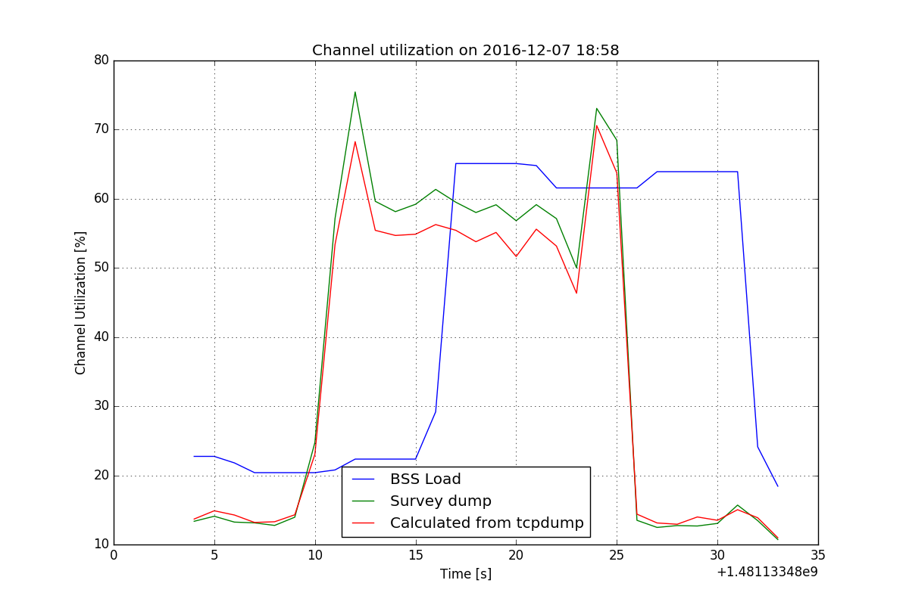

# Question 2

## a) Setup

* Reset bitrates on client

	N15: `iw wlan0 set bitrates`
	
* Turn RTS/CTS off on client

	N15: `iw phy phy0 set rts off`
	
* Prepare a script to run on node 6: `capture_manager.sh`

	```
	# !/usr/bin ash
	
	
	STARTTIME=`date +%s`
	DUMPFILE="tcpdump_${STARTTIME}.cap"
	SURVEYFILE="surveydump_${STARTTIME}.dump"
	
	echo ""
	echo "Starting capture manager"
	echo "Make sure you started nc on SteppingStone with command:  nc -l -p 8080 > filename.cap"
	
	# reset survey counter
	echo "  Resetting counter of survey dump"
	echo "1" > "/sys/kernel/debug/ieee80211/phy0/ath5k/reset"
	
	echo "  Starting tcpdump in the background ..."
	# tcpdump -i wlan1 -w- > $DUMPFILE &
	tcpdump -i wlan1 -w- | nc 172.17.3.1 8080 &
	TCPDUMP_PID=`ps | grep "tcpdump -i wlan1" | grep -v grep | awk '{print $1}'`
	echo "  tcpdump started with PID $TCPDUMP_PID"
	
	for i in `seq 50`; do
	  date +%s >> $SURVEYFILE
	  iw dev wlan0 survey dump >> $SURVEYFILE
	  sleep 0.1
	done
	
	echo "Starting iperf server"
	iperf -s -u > /dev/null 2>&1 &
	IPERF_PID=`ps | grep "iperf -s -u" | grep -v grep | awk '{print $1}'`
	echo "iperf started with PID $IPERF_PID"
	
	for i in `seq 200`; do
	  date +%s >> $SURVEYFILE
	  iw dev wlan0 survey dump >> $SURVEYFILE
	  sleep 0.1
	done
	
	
	kill $IPERF_PID
	sleep 1
	kill $TCPDUMP_PID
	```

	
* Commands for the test:

	SteppingStone: `nc -l -p 8080 > filename.cap`

	N6: `./capture_manager.sh`

	N15: (after we see that iperf has started on N6): `iperf -c 172.17.5.10 -u -b 54M -t 15`

## c) Medium Utilization over time

### Plot



### Conclusion

We can see a slight difference between values received from `iw wlan0 survey dump` and values calculated manually from tcpdump trace using data rate and length of frames, which can be attributed to the fact that in we omitted times for SIFS, DIFS, contention window and propagation delay. We omitted those times because if we wanted to include them in our calculations the right way we would have to check for all the different types of frames when which apply. Doing it this way also lets us know what percentage of medium it actually takes to transmit frames. We did however include the ACK time for UDP packets.

As for why the Channel utilization data we got from BSS Load elements (from the same trace as we computed the utilization manually) is about 6 seconds delayed we have no answer. We double checked the received tcpdump data in Wireshark and we made no mistake plotting the data. We can only assume that the Channel utilization data in BSS Load elements transmitted by other networks is late because they delay and/or average it. Averaging seems a very likely answer when we look at the graph, as it has much lower spikes and variances and is a lot more smooth. 

## d) Medium utilization by frame type 

### Plot


### Conclusion

Here as well we excluded times for SIFS, DIFS, contention window and propagation delay and included ACK time for UDP packets. We filtered UDP packets with `data` in protocols, as we captured one UDP packet which was used for DHCP by another network, which was at the beginning of the trace and sqewed the data quite considerably. Because we think that the purpose of this is to get the distribution while an active UDP data transfer is in progres we included the `data` filter for UDP packets. 

As expected we see the majority of time taken up by UDP packets. Interestingly we can see quite a lot of time with no traffic. Some of that can be attributed to the omitted times in our frame time calculation, but we don't expect that to be more than 10% or 15% in our case. That falls in line with the above graph for Medium utilization in time, where we can see that even though the iperf was throttled (actual bitrate reported was 7.5 Mbit/s) the channel was not used 100%, but instead has at least 20% non-busy time left. We expect this is by design.