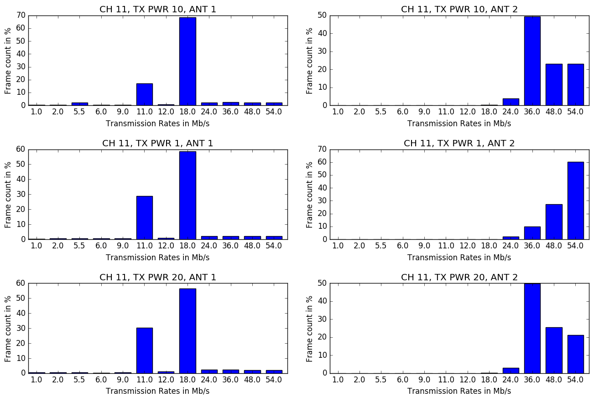

# Question 1: RCA in mac802.11

Network & Terminology:

 * N6  = Node 6  (172.17.5.10 on wlan0, 172.17.3.106 on br-lan)
 * N15 = Node 15 (172.17.5.11 on wlan0)
 * ST  = Stepping Stone (172.17.3.1 on eth1)

## a)

### Setup:

* checking connectivity:

	* **N6 <-> N15**:

		N6: `ping -I wlan0 172.17.5.11 | head -n 2` 
		
		Output: 
		
		```
		PING 172.17.5.11 (172.17.5.11): 56 data bytes
		64 bytes from 172.17.5.11: seq=0 ttl=64 time=0.615 ms
		```
		
		*Connected*
		
	* **N6 <-> ST**:
	
		N6: `ping -I br-lan 172.17.3.1 | head -n 2`
		
		Output:
		
		```
		PING 172.17.3.1 (172.17.3.1): 56 data bytes
		64 bytes from 172.17.3.1: seq=0 ttl=64 time=0.645 ms
		```
		
		*Connected*
		
* checking channel on wireless, either (1,6,11)

	* N6: `iw wlan0 info | grep channel`

		Output:
		`channel 11 (2462 MHz), width: 20 MHz (no HT), center1: 2462 MHz`
		
	* N6: `iw wlan1 info | grep channel`

		Output: 
		`channel 11 (2462 MHz), width: 20 MHz (no HT), center1: 2462 MHz`
		
	* N15: `iw wlan0 info | grep channel`
	
		Output:
		`channel 11 (2462 MHz), width: 20 MHz (no HT), center1: 2462 MHz`
		
	*All cards are on the same channel (11)*
	

* set transmission power to 1.0 dBm on sender

	* N15: `iw dev wlan0 set txpower fixed 100; iw wlan0 info | grep txpower`

		Output (1st line):
	
		`txpower 1.00 dB`
	
* set antenna A fixed for both sender and receiver

	* N6: `echo "fixed-a" > /sys/kernel/debug/ieee80211/phy0/ath5k/antenna`
	
	* N15: `echo "fixed-a" > /sys/kernel/debug/ieee80211/phy0/ath5k/antenna`

* check if ministrel is enabled

	* N15: `dmesg | grep "ieee80211 phy0"`

		Output: 
		
		```
		[   14.225247] ieee80211 phy0: Selected rate control algorithm 'minstrel_ht'
		```
		
		Ministel is enabled
	
* start nc on ST to receive the trace

	* ST: `nc -l -p 8080  > "trace-ch11-1dbm-ant1-$(date +%s).cap"`
	
		File naming structure:
		
		`trace-<ch + channel>-<tx_power + dbm>-<ant + antenna used>-<unix timestamp>.cap`
	
* start iperf server on receiver

	* N6: `iperf -s -u`

* start tcpdump on receiver without capturing the udp body, forward to ST

	* N6: `tcpdump -i wlan1 -s 104 -w- udp | nc 172.17.3.1 8080`
	
		* `-s 104` snaplen of 104 bytes on the frames. enought to have udp header
		* `-i wlan1` interface of the monitor
		* `-w-` outputs to STDOUT

* start iperf client on sender

	* N15: 

		```
		for i in `seq 12`; do 
	    	iperf -c 172.17.5.10 -u -b 55M -t 30 -l 1024
			sleep 2s
		done
		```
		
* Repeat with different txpower and antenna settings:

	* txpower = 10.00dBm, Ant 1

		* n15: `iw dev wlan0 set txpower fixed 1000; iw wlan0 info | grep txpower`
	
		* Output (1st line): 
	
			```
			txpower 10.00 dBm
			```
		* ST: `nc -l -p 8080 > "trace-ch11-10dbm-ant1-$(date +%s).cap"`
	
	* txpower = 20.00dBm, Ant 1

		* n15: `iw dev wlan0 set txpower fixed 2000; iw wlan0 info | grep txpower`
	
		* Output (1st line): 
	
			```
			txpower 20.00 dBm
			```
		* ST: `nc -l -p 8080 > "trace-ch11-20dbm-ant1-$(date +%s).cap"`

		
	* txpower = 1.00dBm, Ant 2

		* n15: `iw dev wlan0 set txpower fixed 100; iw wlan0 info | grep txpower`
	
		* Output (1st line): 
	
			```
			txpower 1.00 dBm
			```
			
		* n6: `echo "fixed-b" > /sys/kernel/debug/ieee80211/phy0/ath5k/antenna`

 		* n15: `echo "fixed-b" > /sys/kernel/debug/ieee80211/phy0/ath5k/antenna`
		
		* ST: `nc -l -p 8080 > "trace-ch11-1dbm-ant2-$(date +%s).cap"`

	* txpower = 10.00dBm, Ant 2

		* n15: `iw dev wlan0 set txpower fixed 1000; iw wlan0 info | grep txpower`
	
		* Output (1st line): 
	
			```
			txpower 10.00 dBm
			```
		
		* ST: `nc -l -p 8080 > "trace-ch11-10dbm-ant2-$(date +%s).cap"`

	* txpower = 20.00dBm, Ant 2

		* n15: `iw dev wlan0 set txpower fixed 2000; iw wlan0 info | grep txpower`
	
		* Output (1st line): 
	
			```
			txpower 20.00 dBm
			```
		
		* ST: `nc -l -p 8080 > "trace-ch11-20dbm-ant2-$(date +%s).cap"`
	
* Repeat all steps at a different time of the day

## b

Since we decoded the timestamp and other meta information in the file name
we can you our pyhton script `capture_times.py`to give us information
about all caputres in a table style.

```
Ordered Overview of capture-time and settings
=================================================================
| 16:41:07 12.12.2016  | ANT:   ant2 | TXPWR:  1dbm | CH:  ch11 |
| 17:02:44 12.12.2016  | ANT:   ant2 | TXPWR: 10dbm | CH:  ch11 |
| 17:12:56 12.12.2016  | ANT:   ant2 | TXPWR: 20dbm | CH:  ch11 |
| 17:28:09 12.12.2016  | ANT:   ant1 | TXPWR:  1dbm | CH:  ch11 |
| 17:47:10 12.12.2016  | ANT:   ant1 | TXPWR: 10dbm | CH:  ch11 |
| 17:59:30 12.12.2016  | ANT:   ant1 | TXPWR: 20dbm | CH:  ch11 |
| 13:28:57 14.12.2016  | ANT:   ant1 | TXPWR: 10dbm | CH:  ch11 |
| 13:39:26 14.12.2016  | ANT:   ant1 | TXPWR:  1dbm | CH:  ch11 |
| 13:53:01 14.12.2016  | ANT:   ant1 | TXPWR: 20dbm | CH:  ch11 |
| 14:06:16 14.12.2016  | ANT:   ant2 | TXPWR:  1dbm | CH:  ch11 |
| 14:16:56 14.12.2016  | ANT:   ant2 | TXPWR: 10dbm | CH:  ch11 |
| 14:45:22 14.12.2016  | ANT:   ant2 | TXPWR: 20dbm | CH:  ch11 |
-----------------------------------------------------------------

12 captures in total
```

### Boxplot: Throughput vs txpower and antenna using minstrel


In this experiment minstrel is enabled as a rate control mechanism. 
On the y-axis there is the throughput given by iperf server log in Mbit/s
versus the six boxplots.
In total there are 12 runs with basically three factors: which of antenna a and b, transmission power of 1dBm, 10 dBm and 20 dBm and lastly the time factor. 
We know from previous assignments and the forum that port 1 has no antenna attached to 
it and port 2 is a pigtail antenna. For antenna port 1 the medians are between 4 and 5 Mbit/s for all transmission power settings. But the throughput is also spread between 1 and 6 Mbit/s. Taking a glimpse on the raw data this is probably due to the different times the frame were captured. Generally speaking, the power transmission setting does not have much influence on the throughput of antenna port 1. The reason for this might be the short distance between the nodes. 

For the pigtail antenna we can see a slightly different behaviour. The distance is 
still the same but the mean for 1 dBm transmission power shows about 1.5 Mbit/s worse performance. While at 10 dBm the quartiles are of same size as antenna port 1, 1 dBm and 20 dBm show a narrower quartiles.

In conclusion we can not see that the transmission power or the antenna has significant
impact on the performance which was not really expected. Assumingly a higher transmission power would lead to better performance. But this is not observable.

### Barplot: Distribution of transmission rate selection



The figure above shows six bar plots for the combination of factor transmission power 
and used antenna port 1 and 2. Column 1 show the relative count of transmission rates
on the y-axis for antenna port 1 and column 2 respectively for antenna port 2.
The rates were gathered from the 802.11 frame header picked by the minstrel mechanism 
of the client. For antenna port 1 we observe two significant peaks at 11.0 Mb/s and 18 Mb/s. with a hasty glance at the raw data we can see that at capture time t1 we have a 
steady transmission rate of 18.0 Mb/s whereas at time t2 its only 11.0 Mb/s. This
timely seperation allows us to conclude that minstrel is selecting a constant rate for 
all transmission power levels. 

For the antenna port 2 we can see that minstrel is selecting way higher rates between
36.0 and 54.0 Mb/s throughout all transmission powers and times. Only at 1 dBm we see 
that it tends to select more higher rates then 10 dBm and 20 dbm. 

If we compare this barplot with the box plot we can conclude that even higher picked 
transmission rates didn't necessarily lead to a higher throughput. Which gives a hint
that the selection wasn't optimal at all experiments.

