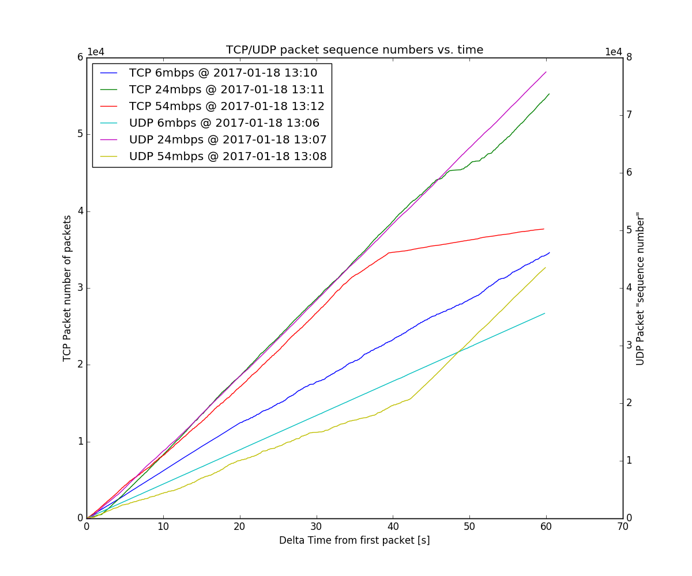

# Question 2: TCP performance

## a)

*following commands are issued both on N6 and N15*

monitor interface uses ath9k card, all other ath5k

### Transmission power: 1 dBm

`iw dev wlan0 set txpower fixed 100`

### Transmission rate: 6 Mbps

`iw dev wlan0 set bitrates legacy-2.4 6.0`

### HW mode

`uci show wireless.radio0.hwmode`

Output: `wireless.radio0.hwmode='11g'` on both N6 and N15

### Disable ANI

`echo ani-off > /sys/kernel/debug/ieee80211/phy0/ath5k/ani`

Test:
`cat /sys/kernel/debug/ieee80211/phy0/ath5k/ani | grep "operating mode"`

Output: `operating mode:			OFF`


### Set Noise Immunity Level to 0

`echo noise-low >/sys/kernel/debug/ieee80211/phy0/ath5k/ani`

Test:
`cat /sys/kernel/debug/ieee80211/phy0/ath5k/ani | grep "noise immunity"`

Output: `noise immunity level:		0`

### Enable OFDM Weak Signal Detection

`echo ofdm-on > /sys/kernel/debug/ieee80211/phy0/ath5k/ani`

Test:
`cat /sys/kernel/debug/ieee80211/phy0/ath5k/ani | grep "OFDM weak"`

Output:
`OFDM weak signal detection:	on`

### RX and TX Antenna = 2 and disable diversity

`echo fixed-b >  /sys/kernel/debug/ieee80211/phy0/ath5k/antenna`

Test:

```
echo clear >  /sys/kernel/debug/ieee80211/phy0/ath5k/antenna
cat /sys/kernel/debug/ieee80211/phy0/ath5k/antenna | grep "\[antenna"
```

Output:

```
[antenna 1]	0	0
[antenna 2]	<some number gt 0>	<some number gt 0>
[antenna 3]	0	0
[antenna 4]	0	0
```

Only Antenna 2 sends and receives

## b)

### Template for a capture

Start nc to receive the trace:

ST: `nc ‐l ‐p 8080 > "trace-<tcp/udp>‐<6/24/54>mbps‐$(date +%s).cap"`

Start iperf server (tcp)

N6: `iperf -s`

Start iperf server (udp)

N6: `iperf -s -u`

Start tcpdump on monitor interface on STA

N6: `tcpdump -i wlan1 -s 104 -w- <udp/tcp> and ip src or dst 172.17.5.10 | nc 172.17.3.1 8080`

* -i defines the interface to capture
* -s removes the udp payload to reduce filesize
* -w- outputs to STDOUT
* udp/tcp filters only udp packets
* ip src or dst filters only packets coming or going from host x


Start sending packets with iperf

N15: 

```
for i in `seq 10`; do
	iperf ‐c 172.17.5.10 ‐u ‐b <7/25/56>M ‐t 60
	sleep 2s
done
```
A loop which performs 10 runs with 60 seconds duration. For the 
tcp run just omit the -u flag.

### Perform runs with these parameters:

*  Transmission rate 6Mbps, udp
*  Transmission rate 24Mbps, udp
*  Transmission rate 54Mbps, udp
*  Transmission rate 6Mbps, tcp
*  Transmission rate 24Mbps, tcp
*  Transmission rate 54Mbps, tcp

## c)

### Part 1: TCP and UDP throughput


### Part 2: Plot packet sequence number versus time

 

TCP generates its packet sequence numbers usually with a incremental random generator, whereas UDP does not support packet numbers natively. `iperf`, which we used to generate traffic in our experiments actually includes its own packet numbers in the UDP data payload, which has no connection to the UDP protocol as such, except that it is used for delivering the packet. `iperf` makes its packet numbers strictly sequential, with the difference of 1.

Because of that, we believe that this comparison holds no useful value, as TCP packet sequence numbers in our test increment on average for 1400 between packets on 6 and 24 Mbps and 2000 when 54Mbps was used. Because of the random nature of increments in TCP we cannot know if any changes in slope were because of slower traffic (lower throughput) or because of the random generator.

If we instead look at a graph where we for TCP plot the converted sequence number (if current sequence number is the same as last, increment last by one and plot it like that), which basically means that we see how packets were delivered, we can see a much different picture, which is in our opinion much better suited for comparison of TCP and UDP.

 

Here we can see that at 6Mbps TCP delivered more packets in the same time, suggesting a higher throughput. At 24Mbps, UDP delivered slightly more packets, but we can see that packet delivery speed of TCP has fallen in the last 15s, which suggests that the channel was busier (perhaps somebody else started running their test). At 54Mbps TCP again delivered more packets, but here the UDP test had a lower packet delivery speed in the first 40s than the last 20, whereas with TCP its packet delivery speed has fallen off in the last 20s. If we were to project the better packet delivery speed of UDP from the start, UDP would deliver more packets.

We expected that UDP will deliver its packets faster, because TCP also implements its own acknowledgements, which take time to transmit. When we checked that in wireshark, we saw that TCP acknowledgements accounted for around 35% of TCP packets (but not 35% traffic, as they are much smaller than data packets). UDP does not implement acknowledgements, because it also does not have the mechanism to detect correct delivery of packets. That is mostly confirmed by our tests, where UDP delivers its packets faster (it also has a bigger payload in the same packet length). 

