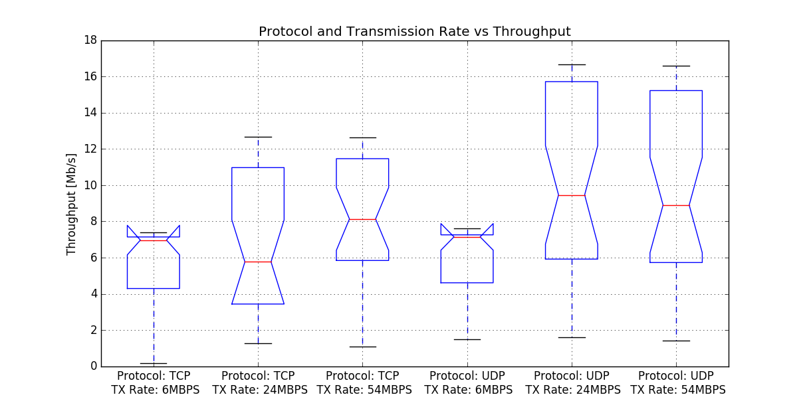
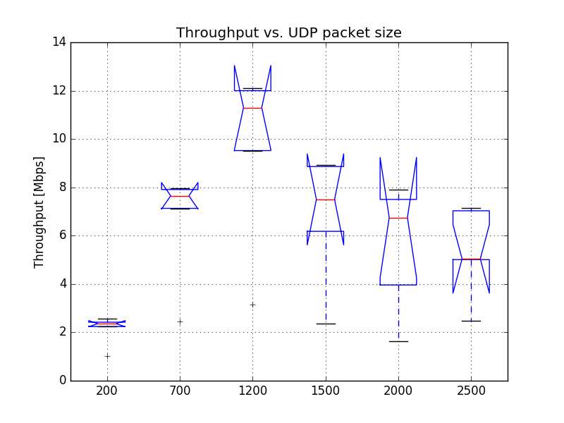
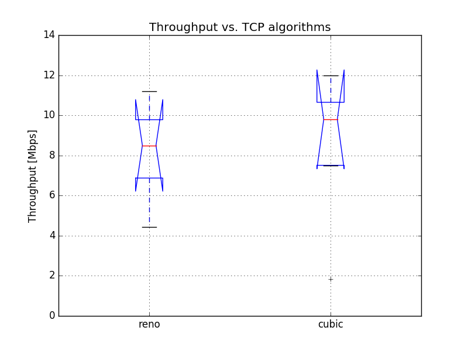

# Question 1: Communication between Station and AccessPoint

## a) Setup and b) Data gathering

Already covered in previous tasks.

## c) Questions:

For questions 1 - 3 we used the data from last assignmnet, as stated on [ISIS](https://isis.tu-berlin.de/mod/forum/discuss.php?d=124753)

For questions 4 - 6 we generated new data, using new instructions posted on ISIS: [UDP packet size](https://isis.tu-berlin.de/mod/forum/discuss.php?d=124736), [TCP Reno/Cubic](https://isis.tu-berlin.de/mod/forum/discuss.php?d=124738)
 
We started with the data gathering on Tue, 24 Jan 2017 12:23:30 GMT and ended on Tue, 24 Jan 2017 21:40:46 GMT. We used a script (mostly the same as in last homework) which did a test run every 15 minutes (7 UDP packet sizes, 2 TCP congestion protocols).

### 1. What is the measured TCP throughput in infrastructure mode from station to access point? Compare this throughput with the physical data rate of 54 Mbps that the hardware is configured with. Can you explain the difference (generic, no calculations needed)?

Graph with results from the last assignment (assignment 9):

 

The difference comes from the fact that the physical data rate of 54Mbps includes all of the traffic, including all headers on each packets (IP header, TCP header, MAC header), all control and management packets (ACKs, etc.). Even if we calculated the throughput of all of bits sent/received, it would still be lower because of lost and retransmitted packets and all the different windows, delays and backoffs of underalying protocols.

### 2. Is the TCP throughput lower compared to the UDP throughput? If yes, why?

Yes, TCP throughput consistently was lower than UDP (except for 6Mbps, where this setting was the bottleneck). TCP introduces additional overhead, which makes it more robust at the expense of throughput. If we had a really nosy environment TCP would probably perform better in regards of throughput. If we need to implement packet sequence / error correction and detection on top of UDP, TCP would probably perform better as well, because it takes care of all of that.

### 3. What is (are) the limiting factor(s) in the TCP protocol?

The core principles and their implications in TCP protocol:

* TCP three-way handshake introduces a full roundtrip of latency.
* TCP slow-start is applied to every new connection.
* TCP flow and congestion control regulate throughput of all connections.
* TCP throughput is regulated by current congestion window size.

As a result, the rate with which a TCP connection can transfer data in modern high-speed networks is often limited by the roundtrip time between the receiver and sender. Further, while bandwidth continues to increase, latency is bounded by the speed of light and is already within a small constant factor of its maximum value. In most cases, latency, not bandwidth, is the bottleneck for TCP.

### 4. What is the optimum packet size (accuracy 1 byte) and the corresponding data rate for maximum UDP throughput?

#### Commands used:

For this (and next question) we went with UDP throughput with variable packet size (option `b)` on [ISIS](https://isis.tu-berlin.de/mod/forum/discuss.php?d=124736#p248190)), as this was something we haven't done before and were interested in the results.

##### Access point: `iperf -s -u`

* `-u`: use UDP instead of TCP

##### Client: `iperf -c 172.17.5.10 -u -b 50M -t 60 -l <size>`

* `-u`: use UDP instead of TCP
* `-b 50M`: We used 50Mbps as stated on [ISIS](https://isis.tu-berlin.de/mod/forum/discuss.php?d=124736)
* `-t 60`: Each run lasts 60s
* `-l <size>`: select UDP packet size

#### Our test results:

#### Explanation:

The optimum UDP packet size is usually 1472 bytes for Ethernet. For Ethernet the MTU (Maximum transmission unit) is usually 1500 (which is also in our nodes). UDP header size is 8 bytes and IPv4 header size is usually 20 bytes (but can be up to 60 bytes). In the case of Ethernet, the IP packet will additionally be wrapped in a MAC packet (14 byte header + 4 byte CRC) which will be embedded in an Ethernet frame (8 byte preamble sequence). This adds 26 bytes of data to the IP packet, but doesn't count against the MTU.

To get the optimal UDP packet length: 

`1500 MTU - 20 IPv4 header - 8 UDP header = 1472 bytes`

We have also confirmed that UDP packets with data length of 1472 bytes have the highest throughput, which has a median of ~13 Mbps.

#### References:

* [StackOverflow](http://stackoverflow.com/questions/14993000/the-most-reliable-and-efficient-udp-packet-size)
* [MTU](https://en.wikipedia.org/wiki/Maximum_transmission_unit)
* [PDU](https://en.wikipedia.org/wiki/Protocol_data_unit)
* [IPv4](https://en.wikipedia.org/wiki/IPv4#Header)
* [UDP](https://en.wikipedia.org/wiki/User_Datagram_Protocol)
* [Ethernet frame](https://en.wikipedia.org/wiki/Ethernet_frame)

### 5. Why is the throughput lower if you use a packet size higher than the optimum? Explain the optimum value as identified previously.

The Maximum Transmission Unit (MTU) is the largest possible frame size of a communications Protocol Data Unit (PDU). For most Ethernet networks this is set to 1500 bytes and this size is used almost universally on access networks. Our nodes are configured with MTU of 1500 bytes as well. As stated before, UDP header size is 8 bytes and IPv4 header size is usually 20 bytes (but can be up to 60 bytes). In the case of Ethernet, the IP packet will additionally be wrapped in a MAC packet (14 byte header + 4 byte CRC) which will be embedded in an Ethernet frame (8 byte preamble sequence). This adds 26 bytes of data to the IP packet, but doesn't count against the MTU.

The explanation for the drop of throughput is that because when we exceed the MTU, which we do if we set the packet size higher than the optimum, the sender has to fragment (split) the packet into two packets to fit in the smaller size tunnel (specified with the MTU). This includes additional processing, overhead and new packet(s), which lowers the throughput. Because we need 2 frames on the medium to transmit one UDP packet the throughput drops by roughly 50%, which can be observed on the graph as well.

### 6. Check the congestion control algorithm in your node `Hint : sysctl -a | grep congestion`. Please carry out measurements twenty times each on TCP Reno and TCP Cubic by sending two parallel iperf streams distributed during the day and plot the throughput and explain your observations.

#### Commands used:

##### Access point: `iperf -s`

##### Client: `iperf -c 172.17.5.10 -b 56M -t 60 -Z <reno/cubic> -P 2`

* `-b 56M`: We used 56Mbps to saturate the medium
* `-t 60`: Each run lasts 60s
* `-Z <reno/cubic>`: Choose the congestion control algorithm 
* `-P 2`: Do 2 TCP streams in parallel

#### Our test results:

 

#### Explanation:

When we compare Reno and Cubic we can see that there is no real difference. Reno median is a bit higher than Cubic, but their confidence intervals overlap, so that doesn't tell much. We can see that Cubic may be more stable, as it has narrower whiskers. This both falls in line with other comparisons that we can find on the internet. Cubic is stated as the most stable of TCP congestion control algorithms, it is also the one used by default with linux kernels 2.6.19 and upwards. Reno is used by default with Windows XP and earlier (some use New Reno - not tested here). Both should work sufficently well for general networking scenarios.

#### References:
* [TCP congestion control](https://en.wikipedia.org/wiki/TCP_congestion_control)

