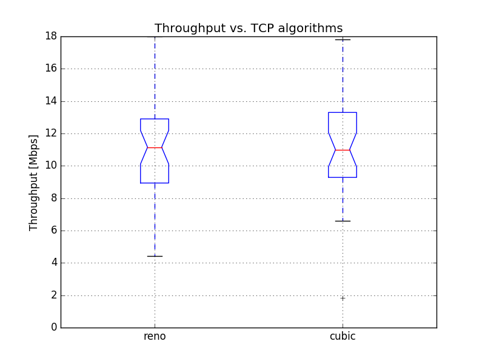

# Question 1: Communication between Station and AccessPoint

## a) Setup and b) Data gathering

Already covered in previous tasks.

## c) Questions:

For questions 1 - 3 we used the data from last assignmnet, as stated in [ISIS](https://isis.tu-berlin.de/mod/forum/discuss.php?d=124753)

### 1. What is the measured TCP throughput in infrastructure mode from station to access point? Compare this throughput with the physical data rate of 54 Mbps that the hardware is configured with. Can you explain the difference (generic, no calculations needed)?

### 2. Is the TCP throughput lower compared to the UDP throughput? If yes, why?

Yes, TCP throughput consistently was lower than UDP (except for 6Mbps, where this setting was the bottleneck). TCP introduces additional overhead, which makes it more robust at the expense of throughput. If we had a really nosy environment TCP would probably perform better in regards of throughput. If we need to implement packet sequence / error correction and detection on top of UDP, TCP would probably perform better as well, because it takes care of all of that.

### 3. What is (are) the limiting factor(s) in the TCP protocol?

### 4. What is the optimum packet size (accuracy 1 byte) and the corresponding data rate for maximum UDP throughput?

#### Commands used:

##### Access point: `iperf -s -u`

* `-u`: use UDP instead of TCP

##### Client: `iperf -c 172.17.5.10 -u -b 50M -t 60 -l <size>`

* `-u`: use UDP instead of TCP
* `-b 50M`: We used 50Mbps as stated on [ISIS](https://isis.tu-berlin.de/mod/forum/discuss.php?d=124736)
* `-t 60`: Each run lasts 60s
* `-l <size>`: select UDP packet size

#### Our test results:

#### Explanation:

#### References:

* [StackOverflow](http://stackoverflow.com/questions/14993000/the-most-reliable-and-efficient-udp-packet-size)

* [MTU](https://en.wikipedia.org/wiki/Maximum_transmission_unit)

* [PDU](https://en.wikipedia.org/wiki/Protocol_data_unit)

### 5. Why is the throughput lower if you use a packet size higher than the optimum? Explain the optimum value as identified previously.

`Hint: look at configuration settings at network layer (output of ifconfig) and data link layer (output of iwinfo). What are the sizes of the headers of IP, UDP, etc. ? `

### 6. Check the congestion control algorithm in your node `Hint : sysctl -a | grep congestion`. Please carry out measurements twenty times each on TCP Reno and TCP Cubic by sending two parallel iperf streams distributed during the day and plot the throughput and explain your observations.

#### Commands used:

##### Access point: `iperf -s`

##### Client: `iperf -c 172.17.5.10 -b 56M -t 60 -Z <reno/cubic> -P 2`

* `-b 56M`: We used 56Mbps to saturate the medium
* `-t 60`: Each run lasts 60s
* `-Z <reno/cubic>`: Choose the congestion control algorithm 
* `-P 2`: Do 2 TCP streams in parallel

#### Our test results:

 

#### Explanation:

