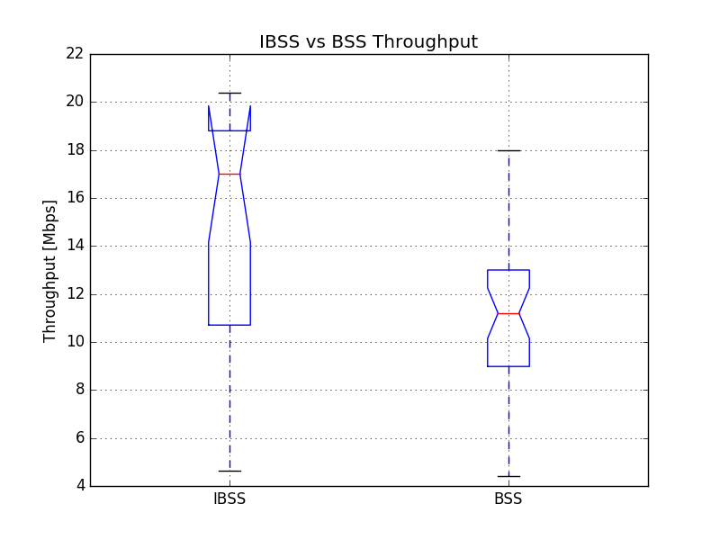

# Question 2: Communication between two Ad-Hoc nodes

# Terminology
* N6: Node 6
* N15: Node15
* ST: Stepping Stone
* PC: Personal Computer

# a) Setup

* First we setup up, what was the AP (N6):
	* Disable the AP interface: `ifconfig wlan0 down`
	* Add ibss type i-face: `iw phy phy0 interface add ah0 type ibss`
	* Bring it up: `ifconfig ah0 up`
	* Check it: `ifconfig ah0`

	  Output:
	  
	  ```
		ah0       Link encap:Ethernet  HWaddr 00:1B:B1:07:DB:9B
		          UP BROADCAST MULTICAST  MTU:1500  Metric:1
		          RX packets:0 errors:0 dropped:0 overruns:0 frame:0
		          TX packets:0 errors:0 dropped:0 overruns:0 carrier:0
		          collisions:0 txqueuelen:1000
		          RX bytes:0 (0.0 B)  TX bytes:0 (0.0 B) 
     ```
   
   * Create ad hoc network: `iw dev ah0 ibss join grp6-adhoc 2462`
   	  We expect most of the other students to take the example 	  frequency on CH1 so we go on CH11 (2,462 GHz)
   	  
   * Check settings `iw dev ah0 info`

   	  Output:
   	  
   	  ```
   	  Interface ah0
			ifindex 1830
			wdev 0x392
			addr 00:1b:b1:07:db:9b
			ssid grp6-adhoc
			type IBSS
			wiphy 0
			channel 11 (2462 MHz), width: 20 MHz (no HT), center1: 2462 MHz
			txpower 30.00 dBm
			txpower 30.00 dBm
	   ```
	   
	   looks good.
		
   	  
   * Assign it a static inet address

   		`ifconfig ah0 172.17.5.10`
   		`ifconfig ah0 netmask 255.255.255.0` 

* Setup the second participant which was the STA before on N15:
	* Disable the STA interface: `ifconfig wlan0 down`
	* Add ibss type i-face: `iw phy phy0 interface add ah0 type ibss`
	* Bring it up: `ifconfig ah0 up`
	* Check it: `ifconfig ah0`

	  Output:
	  
	  ```
		ah0       Link encap:Ethernet  HWaddr 00:1B:B1:01:DC:B4
		          UP BROADCAST MULTICAST  MTU:1500  Metric:1
		          RX packets:0 errors:0 dropped:0 overruns:0 frame:0
		          TX packets:0 errors:0 dropped:0 overruns:0 carrier:0
		          collisions:0 txqueuelen:1000
		          RX bytes:0 (0.0 B)  TX bytes:0 (0.0 B)
     ```
   * Join ad hoc network: `iw dev ah0 ibss join grp6-adhoc 2462`
   * Check settings `iw dev ah0 info`

   	  Output:
   	  
   	  ```
	 	Interface ah0
			ifindex 915
			wdev 0x390
			addr 00:1b:b1:01:dc:b4
			ssid grp6-adhoc
			type IBSS
			wiphy 0
			channel 11 (2462 MHz), width: 20 MHz (no HT), center1: 2462 MHz
			txpower 30.00 dBm
			txpower 30.00 dBm
		```
		
		looks also good.
		
	* Assign it a static inet address

   		`ifconfig ah0 172.17.5.11`
   		`ifconfig ah0 netmask 255.255.255.0`
   		
* Check if with ping if a connection is establishable 

	* N6: `ping 172.17.5.11`

	  Output (first two lines):
	  
	  ```
	  PING 172.17.5.11 (172.17.5.11): 56 data bytes
     64 bytes from 172.17.5.11: seq=0 ttl=64 time=0.963 ms
	  ```
	  
	* N15: `ping 172.17.5.10`

	  Output (first two lines):
	  
	  ```
	  PING 172.17.5.10 (172.17.5.10): 56 data bytes
	  64 bytes from 172.17.5.10: seq=0 ttl=64 time=0.955 ms
	  ```

* Make sure we have the exact same HW settings as on the previous experiment. (Commands executed on N6 and N15)

	* Transmission Power: `iw ah0 set txpower fixed 100` (1dBm)
	* Transmission Rate: `iw ah0 set bitrates legacy-2.4 54`
	* Kernel mods remain untouched

	
## b) IBSS vs BSS Throughput

### Independend and Infrastructure mode performance comparison

We try to give a theoretical comparison of the two modes in terms of throughput performance. Given the setup constraints we can state that
there are no hardware factors on the throughput because the setups are
identical (e.g. Channel, TxPower, TxRate ...) only the experiment time
is different. To keep this influencing factor as low as possible we
acquire the date spread over the day which gives as a good profile.

The difference in the modes that can impact the performance is the way
the network is managed. In an BSS the AP basically the manager of all
to it connected nodes, but in an IBSS there is no such responsibility.
That introduces additional traffic on the medium namely beacon frames,
which every node in an IBSS sends out periodically. With a growing number
of nodes the number of beacons grows and occupies the medium. In an BSS
the number of beacons is independent from the number of STA in range.

The minimal network of an BSS consists of an AP and a STA where we have
one beacon emitter (AP), in an IBSS we have two STA that both send out
beacons. So we'd expect a slightly worse throughput in IBSS mode. But that's might not noticeable. But the throughput would worsen with 
additional STAs broadcasting beacons, whereas in an BSS that wouldn't
have an impact.

### Experiment Setup

* start iperf server on N6 with `iperf -s`
* execute script `capture_script.sh` on N15: 

	```
	for i in `seq 10`; do
	  echo "Timestamp: $(date +%s)"
	
	  iperf -c 172.17.5.10 -b 56M -t 60 -Z reno -P 2
	  sleep 14m
	done
	```
* started at Wed, 25 Jan 2017 14:03:32 GMT, did 10 runs every 15min
* started another at Wed, 25 Jan 2017 17:47:04 GMT, did 10 runs every 15min

On run takes 60 s then we wait for 14 min and run the next round.
The iperf run is identical to that one in question 1, task c subtask 6.
We took tcp reno for comparison.

### Test results



### Explanation

The left plot is the throughput boxplot of the experiment in an
ibss network mode. On the right side for comparison, we have the 
corresponding from the previous task.

The ibss network mode in general performed better in terms of throughput
(median at 17 Mbps) than the bss (median at 11 Mbps). But the ibss plot
reveals that in this experiment the throughput is much more volatile.
This result is not what we expected in our presumption.

We think that the difference between these data sets can only be caused
by the different days we captured the data. Although we tried to match the
time of the day the traffic can be totatly different on two distinct days.
